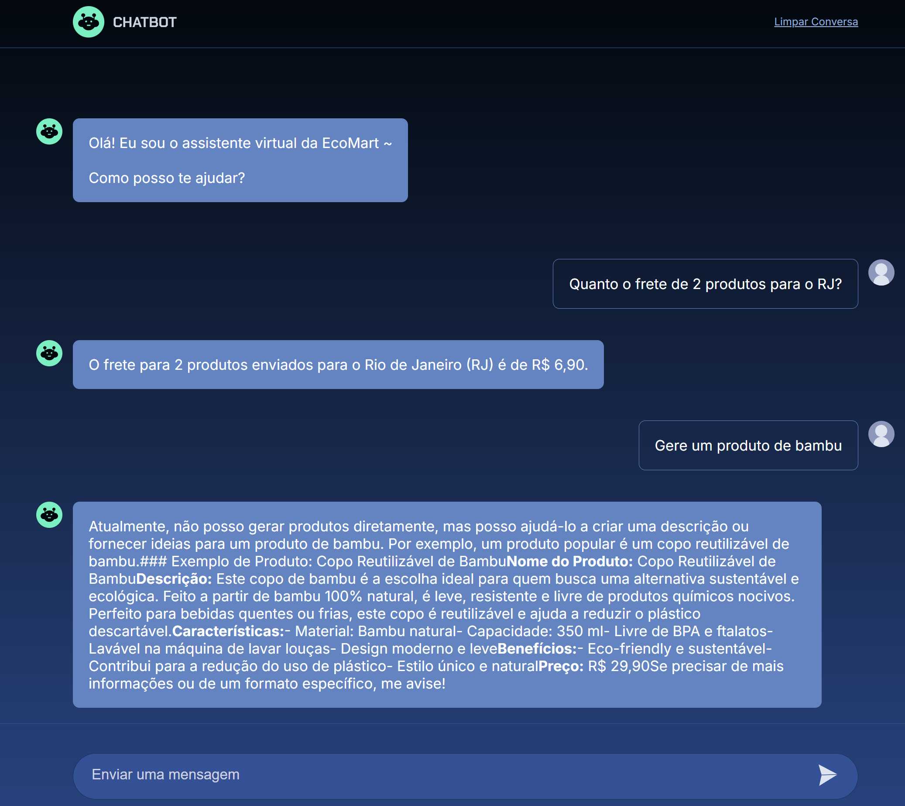

# OpenAI Integration exercise (Ecomart)

Using a project from Alura as a starting point, this is just an exercise on how to connect with OpenAI APIs and communicate, wihtout having any other purposes such as being a full production-ready application.

While the original project was created with theokanning's open-ai Java, this version was developed since the beginning with the official OpenAI Java library.

Other extra changes were made, such as having both sync and async clients.

## How to Run

 - Provide the environment variables:
   - OpenAI Library mandatory environment variables:
     - OPENAI_PROJECT_ID
     - OPENAI_API_KEY
     - OPENAI_ORG_ID
   - Create your assistant with OpenAI's playground and provide the id:
     - ASSISTANT_ID

 - In the property files, choose between Sync or Async client.

### Assistant files and functions

Check [here](https://github.com/CezarAug/chatbot-test-openai/blob/f831328f4006811b4ce7eebd88405046118cafe6/src/main/resources/ecomart) for both instructions and functions created in the OpenAi dashboard.

### Screenshot

Once you have everything up and running, it should look like this:

### Current issues and ideas to improve

 - Messages on browser are not breaking lines properly
 - When an answer uses the instruction documents as source, the reference marks needs to be removed (The number between brackets)
 - Add mechanisms to avoid abusing the API (e.g.: Now allow new inputs while the current one is being processed, limit the total amount of messages)
 - ThreadId needs better handling (Maybe attach it to the user session? cache it?)
 - Original code is in Brazilian Portuguese, while new functions and changes were switched to English.

### Base project
 - Repository: https://github.com/alura-cursos/3571-openai-java-2/
 - Course: https://www.alura.com.br/curso-online-gpt-java-desenvolva-chatbot-ia

